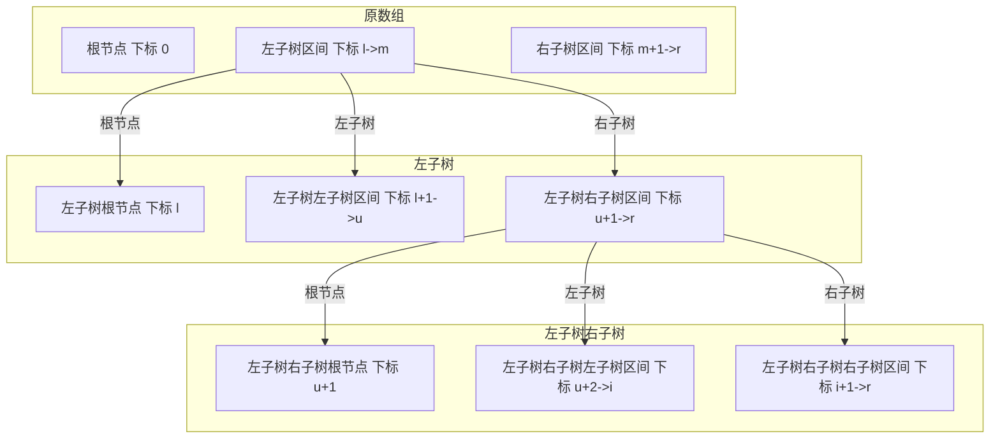

# LeetCode 1008

### 关键信息
> https://leetcode-cn.com/problems/construct-binary-search-tree-from-preorder-traversal/


### 题面
给定数组为要生成的数组的先序遍历结果，根据输入的数组输出原树根节点，例：<br/>
**输入：**[8,5,1,7,10,12]<br/>
**输出：**[8,5,10,1,7,null,12]<br/>


### 解题思路
整体思路为二分法，将数组递归二分生成原树结构<br/><br/>
由于是先序遍历生成的序列结果，那么数组第一个元素一定为根节点，剩余部分为根节点的左右子树<br/><br/>
因为原树为二叉搜索树，那么左子树一定全部小于根节点且小于右子树<br/><br/>
根据这个条件，可以找出剩余数组中的分界点，将剩余数组分为两部分，一部分为左子树，一部分为右子树，继续递归生成树<br/><br/>
如图所示：



### AC代码
```java
/**
 * Definition for a binary tree node.
 * public class TreeNode {
 *     int val;
 *     TreeNode left;
 *     TreeNode right;
 *     TreeNode(int x) { val = x; }
 * }
 */
class Solution {
    public TreeNode bstFromPreorder(int[] preorder) {
        if (preorder == null || preorder.length == 0) {
            return null;
        }
        return bstFromPreorder(preorder, 0, preorder.length - 1);
    }
    
    private TreeNode bstFromPreorder(int[] preorder, int s, int t) {
        if (t < s) {
            return null;
        }
        if (s == t) {
            return new TreeNode(preorder[s]);
        }
        int val = preorder[s];
        TreeNode node = new TreeNode(val);
        int rs = s + 1;
        while (rs < preorder.length && preorder[rs] < val) {
            rs ++;
        }
        node.left = bstFromPreorder(preorder, s + 1, rs - 1);
        node.right = bstFromPreorder(preorder, rs, t);
        return node;
    }
}
```
