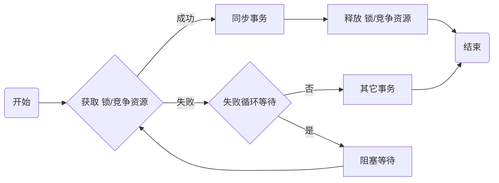
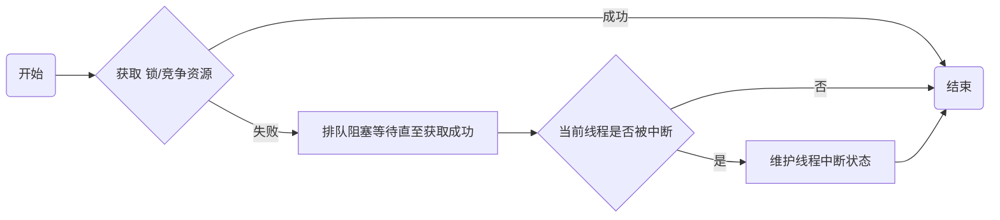
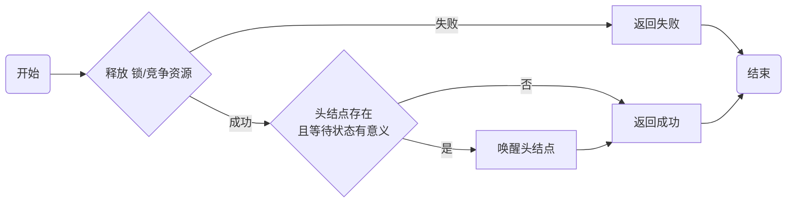

# AQS源码学习 一

### 关键信息
> jdk 1.8<br/>
> java.util.concurrent.locks.AbstractQueuedSynchronizer

### 摘要
- state字段
- acquire方法
- release方法

### 锁/竞争资源
AQS直译就是“抽象队列同步器”，有如下功能：
- 原子获取竞争资源
- 原子释放竞争资源
- 排队阻塞等待竞争资源
- 支持条件等待队列

使用 锁/竞争资源 一般的流程如下：



### volatile int state
```java
//同步状态字段
private volatile int state;
```
关于[volatile](#)，这里不细说，只指出三个性质：
- 原子性
- 可见性
- 有序性

这三个性质也就是锁需要的三个性质，volatile形容的变量本身就可以用来做原子操作，可以用来实现锁或者可竞争资源
&nbsp;
获取锁和释放锁的过程就需要操作这个state字段，但是单使用一个字段不行
需要配合cas操作来进行  **判断+更换** 的原子操作
```java
//state的getter
protected final int getState() {
    return state;
}
//state的setter
protected final void setState(int newState) {
    state = newState;
}
//state的cas原子修改操作
protected final boolean compareAndSetState(int expect, int update) {
    // See below for intrinsics setup to support this
    return unsafe.compareAndSwapInt(this, stateOffset, expect, update);
}
```
cas操作判断当前值是否和expect相等，相等则替换成update
由于操作满足原子性，结果满足可见性，所以当一个线程cas修改成功时，其他线程必然修改失败，此处就有了排它性
### acquire
```java
//排它获取资源/锁
public final void acquire(int arg) {
    if (!tryAcquire(arg) &&
        acquireQueued(addWaiter(Node.EXCLUSIVE), arg))
        selfInterrupt();
}
```
此方法阻塞等待获取资源，获取失败时会阻塞等待直至获取成功，流程逻辑大致为：



*tryAcquire(arg)* 是个模板方法，交由子类实现具体逻辑，方法意为尝试获取资源或锁，只做尝试，不进入队列阻塞等待
参数arg这里并没展现出具体意义，根据不同的实现会有不同的用处，例如：
- ReentrantLock的实现为增加重入次数
- ReentrantReadWriteLock的实现为增加写锁重入次数

*acquireQueued(addWaiter(Node.EXCLUSIVE), arg)* 这一步将当前线程包装成 **排它节点** 加入等待队列并阻塞当前线程，被唤醒后会再次调用tryAcquire，直至成功为止

*selfInterrupt()* 用来维护中断状态

### acquireShared
有排它获取就有共享获取，也就是 *acquireShared(arg)*
```java
//共享获取资源/锁
public final void acquireShared(int arg) {
    if (tryAcquireShared(arg) < 0)
        doAcquireShared(arg);
}
```
这里的逻辑貌似简单了些，其实内部逻辑和acquire方法是一样的，也是失败了会加入等待队列阻塞等待直至成功，成功后会判断维护线程中断状态，逻辑被包含在了doAcquireShared方法中

*tryAcquireShared(arg)* 同样是个模板方法，交由子类实现具体逻辑，意义稍不一样，为以共享方式尝试获取，可以按共享锁来理解
它的返回值为负数表示失败（实际大多为-1），返回值大于等于0时意义也不尽相同，例如：
- Semaphore的实现为剩余信号量数量
- ReentrantReadWriteLock的实现为直接返回1表示获取读锁成功

*doAcquireShared(arg)* 会把当前线程包装成 **共享节点** 加入等待队列并阻塞当前线程，被唤醒后会再次调用tryAcquireShared，直至成功为止

### release
```java
//释放锁/资源
public final boolean release(int arg) {
    if (tryRelease(arg)) {
        Node h = head;
        if (h != null && h.waitStatus != 0)
            unparkSuccessor(h);
        return true;
    }
    return false;
}
```
尝试释放资源，成功则唤醒等待队列头结点，流程逻辑大致为：


> 关于等待队列结构、acquireQueued、doAcquireShared、unparkSuccessor本篇不细说
