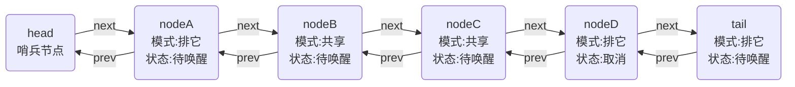

# AQS源码学习 二

### 关键信息
> jdk 1.8<br/>
> java.util.concurrent.locks.AbstractQueuedSynchronizer

### 摘要
- 等待队列结构
- 内部类Node
- head &amp; tail 字段
- 等待队列操作

### 等待队列结构
AQS内部等待队列由 Node类 与 head、tail字段构成结构，若干方法封装操作逻辑

###### Node类
```java
static final class Node {
    //节点共享模式常量值
    static final Node SHARED = new Node();
    //节点排它模式常量值
    static final Node EXCLUSIVE = null;
    //下为waitStatus字段状态值
    static final int CANCELLED =  1;//取消
    static final int SIGNAL    = -1;//待唤醒
    static final int CONDITION = -2;//等待条件中
    static final int PROPAGATE = -3;//无条件传播
    //等待状态，具体值见上方
    volatile int waitStatus;
    //等待队列前驱节点
    volatile Node prev;
    //等待队列后继节点
    volatile Node next;
    //本节点所在的线程
    volatile Thread thread;
    //用来表示 模式 或 条件队列后继
    Node nextWaiter;
    //判断节点是否为共享模式
    final boolean isShared() {
        return nextWaiter == SHARED;
    }
    //返回前驱节点
    final Node predecessor() throws NullPointerException {
        Node p = prev;
        if (p == null)
            throw new NullPointerException();
        else
            return p;
    }
    //以下三个构造方法
    Node() {
    }
    Node(Thread thread, Node mode) {
        this.nextWaiter = mode;
        this.thread = thread;
    }
    Node(Thread thread, int waitStatus) {
        this.waitStatus = waitStatus;
        this.thread = thread;
    }
}
```

###### 队列头、尾
```java
//等待队列头结点
private transient volatile Node head;
//等待队列尾节点
private transient volatile Node tail;
```

以上内部Node类中大部分字段和head、tail字段都是[volatile](#)形容的，配合cas实现原子操作<br/>
注意到Node类中有个nextWaiter字段不是volatile形容的，这个字段有两个意义：
- 在等待队列中用来标记模式（共享或排它），这个字段只会在构造方法中传入写，所以线程安全
- 在condition条件等待队列中，由于调用await和signal方法时必然持有当前锁，所以这个字段不会出现多线程并发写的情况，至多只会有一个线程在修改（不一定是本线程）

因此这个nextWaiter字段不需要被volatile形容，操作时也没有配合cas，因为其操作是完全线程安全的<br/>
至于condition条件等待队列，之后会讲<br/>
<br/>
正在运行中的队列的结构可能为：

注意，head其实是个哨兵节点，没有实际意义，实际的等待队列第一个等待节点是head的后继节点<br/>
head一般会是当前持有锁的线程原来加入队列等待时对应的节点（但也不一定）在获取锁后将本节点数据清除后留下来的节点

### 等待队列操作
等待队列的操作是直接在AQS中的方法，而不在Node类中，因为主要是配合head和tail字段来维护队列，Node类只是一个保存等待节点信息的数据结构而已
###### 入队
```java
//入队
private Node enq(final Node node) {
    for (;;) {
        Node t = tail;
        if (t == null) {//初始化队列
            if (compareAndSetHead(new Node()))
                tail = head;
        } else {
            node.prev = t;
            if (compareAndSetTail(t, node)) {
                t.next = node;
                return t;
            }
        }
    }
}
//添加等待节点
private Node addWaiter(Node mode) {
    Node node = new Node(Thread.currentThread(), mode);
    
    Node pred = tail;
    if (pred != null) {
        node.prev = pred;
        if (compareAndSetTail(pred, node)) {
            pred.next = node;
            return node;
        }
    }
    enq(node);
    return node;
}
//设置节点为头结点（哨兵节点），清除持有线程和前驱节点信息
private void setHead(Node node) {
    head = node;
    node.thread = null;
    node.prev = null;
}
```
enq方法一般是由其它方法来调用，完成入队操作，在无condition的情况下主要由addWaiter方法调用<br/>
第一次进入队列时tail肯定为null，说明队列还不存在，需要初始化，于是cas设置head为一个新的空节点作为哨兵节点，同时tail也指向head<br/>
然后自旋cas将本节点设置为尾部（入队），成功后更新原尾节点后后继为本节点<br/>
addWaiter方法其实就是率先快速做一遍尝试入队操作，失败了就进入enq方法自旋入队直至成功
<br/>
可以看到，volatile配合cas操作有着排它性，再通过自旋操作相当于就是个简易的自旋乐观锁，可以比较高效的做原子修改，并且线程安全<br/>
<br/>
addWaiter方法其实也是被其它方法调用的，会返回添加完毕后的当前节点，而其调用方就是acquire方法和doAcquireShared方法，上一篇里有说到

###### 排它节点入队
```java
public final void acquire(int arg) {
    if (!tryAcquire(arg) &&
        acquireQueued(addWaiter(Node.EXCLUSIVE), arg))
        selfInterrupt();
}
//加入队列后，阻塞等待
final boolean acquireQueued(final Node node, int arg) {
    boolean failed = true;
    try {
        boolean interrupted = false;
        for (;;) {
            final Node p = node.predecessor();
            if (p == head && tryAcquire(arg)) {
                setHead(node);
                p.next = null; // help GC
                failed = false;
                return interrupted;
            }
            if (shouldParkAfterFailedAcquire(p, node) &&
                parkAndCheckInterrupt())
                interrupted = true;
        }
    } finally {
        if (failed)
            cancelAcquire(node);
    }
}
//前驱节点状态维护
private static boolean shouldParkAfterFailedAcquire(Node pred, Node node) {
    int ws = pred.waitStatus;
    if (ws == Node.SIGNAL)
        return true;
    if (ws > 0) {
        do {
            node.prev = pred = pred.prev;
        } while (pred.waitStatus > 0);
        pred.next = node;
    } else {
        compareAndSetWaitStatus(pred, ws, Node.SIGNAL);
    }
    return false;
}
//阻塞线程，被唤醒后检测中断状态
private final boolean parkAndCheckInterrupt() {
    LockSupport.park(this);
    return Thread.interrupted();
}
```
acquireQueued方法也是一个自旋的模式，它先会判断本节点的前驱是否为head(哨兵)，也就是说本节点是否已经在队首<br/>
在队首的节点可以去尝试获取锁，也就是调用tryAcquire方法<br/>
如果成功了，会将本节点设置为头结点，setHead方法里会把节点持有的线程信息和前驱节点信息清除，然后将本节点的前驱节的后继清除，返回线程的中断状态<br/>
失败则会进入shouldParkAfterFailedAcquire方法，这个方法维护前驱节点的状态，返回本节点是否需要阻塞等待：
- 前驱节点的状态为SIGNAL，说明前驱也在等待，所以本节点也就乖乖阻塞等待好了
- 前驱节点状态大于0，其实就是取消状态，那么把所有取消状态的前驱清除，返回false，再次尝试获取锁
- 剩余情况为0或者PROPAGATE（CONDITION状态不会在等待队列中），需要将前驱设置为SIGNAL状态，但本节点不一定需要阻塞，前驱可能是刚释放锁的节点，再次尝试确保需要阻塞等待
  
