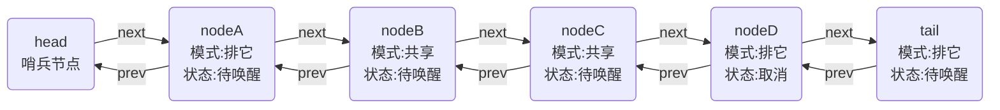

# AQS源码学习 二

### 关键信息
> jdk 1.8<br/>
> java.util.concurrent.locks.AbstractQueuedSynchronizer

### 摘要
- 等待队列结构
- 内部类Node
- head &amp; tail 字段
- 等待队列操作
- 获取与释放
- 状态变化

### 等待队列结构
AQS内部等待队列由 Node类 与 head、tail字段构成结构，若干方法封装操作逻辑

###### Node类
```java
static final class Node {
    //节点共享模式常量值
    static final Node SHARED = new Node();
    //节点排它模式常量值
    static final Node EXCLUSIVE = null;
    //下为waitStatus字段状态值
    static final int CANCELLED =  1;//取消
    static final int SIGNAL    = -1;//待唤醒
    static final int CONDITION = -2;//等待条件中
    static final int PROPAGATE = -3;//共享模式传播唤醒
    //等待状态，具体值见上方
    volatile int waitStatus;
    //等待队列前驱节点
    volatile Node prev;
    //等待队列后继节点
    volatile Node next;
    //本节点所在的线程
    volatile Thread thread;
    //用来表示 模式 或 条件队列后继
    Node nextWaiter;
    //判断节点是否为共享模式
    final boolean isShared() {
        return nextWaiter == SHARED;
    }
    //返回前驱节点
    final Node predecessor() throws NullPointerException {
        Node p = prev;
        if (p == null)
            throw new NullPointerException();
        else
            return p;
    }
    //以下三个构造方法
    Node() {
    }
    Node(Thread thread, Node mode) {
        this.nextWaiter = mode;
        this.thread = thread;
    }
    Node(Thread thread, int waitStatus) {
        this.waitStatus = waitStatus;
        this.thread = thread;
    }
}
```

###### 队列头、尾
```java
//等待队列头结点
private transient volatile Node head;
//等待队列尾节点
private transient volatile Node tail;
```

以上内部Node类中大部分字段和head、tail字段都是[volatile](#)形容的，配合cas实现原子操作<br/>
注意到Node类中有个nextWaiter字段不是volatile形容的，这个字段有两个意义：
- 在等待队列中用来标记模式（共享或排它），这个字段只会在构造方法中传入写，所以线程安全
- 在condition条件等待队列中，由于调用await和signal方法时必然持有当前锁，所以这个字段不会出现多线程并发写的情况，至多只会有一个线程在修改（不一定是本线程）

因此这个nextWaiter字段不需要被volatile形容，操作时也没有配合cas，因为其操作是完全线程安全的<br/>
至于condition条件等待队列，之后会讲<br/>
<br/>
正在运行中的队列的结构可能为：



注意，head其实是个哨兵节点，没有实际意义，实际的等待队列第一个等待节点是head的后继节点<br/>
head一般会是当前持有锁的线程原来加入队列等待时对应的节点（但也不一定）在获取锁后将本节点数据清除后留下来的节点

### 等待队列操作
等待队列的操作是直接在AQS中的方法，而不在Node类中，因为主要是配合head和tail字段来维护队列，Node类只是一个保存等待节点信息的数据结构而已
#### 入队
```java
//入队
private Node enq(final Node node) {
    for (;;) {
        Node t = tail;
        if (t == null) {//初始化队列
            if (compareAndSetHead(new Node()))
                tail = head;
        } else {
            node.prev = t;
            if (compareAndSetTail(t, node)) {
                t.next = node;
                return t;
            }
        }
    }
}
//添加等待节点
private Node addWaiter(Node mode) {
    Node node = new Node(Thread.currentThread(), mode);
    
    Node pred = tail;
    if (pred != null) {
        node.prev = pred;
        if (compareAndSetTail(pred, node)) {
            pred.next = node;
            return node;
        }
    }
    enq(node);
    return node;
}
//设置节点为头结点（哨兵节点），清除持有线程和前驱节点信息
private void setHead(Node node) {
    head = node;
    node.thread = null;
    node.prev = null;
}
```
enq方法一般是由其它方法来调用，完成入队操作，在无condition的情况下主要由addWaiter方法调用<br/>
第一次进入队列时tail肯定为null，说明队列还不存在，需要初始化，于是cas设置head为一个新的空节点作为哨兵节点，同时tail也指向head<br/>
然后自旋cas将本节点设置为尾部（入队），成功后更新原尾节点后后继为本节点<br/>
addWaiter方法其实就是率先快速做一遍尝试入队操作，失败了就进入enq方法自旋入队直至成功
<br/>
可以看到，volatile配合cas操作有着排它性，再通过自旋操作相当于就是个简易的自旋乐观锁，可以比较高效的做原子修改，并且线程安全<br/>
<br/>
addWaiter方法其实也是被其它方法调用的，会返回添加完毕后的当前节点，而其调用方就是acquire方法和doAcquireShared方法，上一篇里有说到

#### 出队
入队和出队都是在一起控制的，获取锁失败入队并阻塞等待，被唤醒后获取锁成功则出队，所以接下来讲获取锁和释放锁的逻辑

### 获取锁/资源
###### 排它节点获取
```java
public final void acquire(int arg) {
    if (!tryAcquire(arg) &&
        acquireQueued(addWaiter(Node.EXCLUSIVE), arg))
        selfInterrupt();
}
//加入队列后，阻塞等待
final boolean acquireQueued(final Node node, int arg) {
    boolean failed = true;
    try {
        boolean interrupted = false;
        for (;;) {
            final Node p = node.predecessor();
            if (p == head && tryAcquire(arg)) {
                setHead(node);
                p.next = null; // help GC
                failed = false;
                return interrupted;
            }
            if (shouldParkAfterFailedAcquire(p, node) &&
                parkAndCheckInterrupt())
                interrupted = true;
        }
    } finally {
        if (failed)
            cancelAcquire(node);
    }
}
//前驱节点状态维护
private static boolean shouldParkAfterFailedAcquire(Node pred, Node node) {
    int ws = pred.waitStatus;
    if (ws == Node.SIGNAL)
        return true;
    if (ws > 0) {
        do {
            node.prev = pred = pred.prev;
        } while (pred.waitStatus > 0);
        pred.next = node;
    } else {
        compareAndSetWaitStatus(pred, ws, Node.SIGNAL);
    }
    return false;
}
//阻塞线程，被唤醒后检测中断状态
private final boolean parkAndCheckInterrupt() {
    LockSupport.park(this);
    return Thread.interrupted();
}
```
acquireQueued方法也是一个自旋的模式，它先会判断本节点的前驱是否为head(哨兵)，也就是说本节点是否已经在队首<br/>
在队首的节点可以去尝试获取锁，也就是调用tryAcquire方法<br/>
如果成功了，会将本节点设置为头结点，setHead方法里会把节点持有的线程信息和前驱节点信息清除，然后将本节点的前驱节的后继清除，返回线程的中断状态<br/>
失败则会进入shouldParkAfterFailedAcquire方法，这个方法维护前驱节点的状态，返回本节点是否需要阻塞等待：
- 前驱节点的状态为SIGNAL，说明前驱也在等待，所以本节点也就乖乖阻塞等待好了
- 前驱节点状态大于0，其实就是取消状态，那么把所有取消状态的前驱清除，返回false，再次尝试获取锁
- 剩余情况为0或者PROPAGATE（CONDITION状态不会在等待队列中），需要将前驱设置为SIGNAL状态，但本节点不一定需要阻塞，前驱可能是刚释放锁的节点，再次尝试确保需要阻塞等待

如果需要阻塞等待则会进入parkAndCheckInterrupt方法，LockSupport.park会阻塞当前线程（实际上不一定会阻塞），可以被unpark唤醒也可以响应线程中断而唤醒<br/>
被唤醒后检测线程的中断状态并返回，注意Thread.interrupted会返回中断状态但也会清除掉线程的中断状态，所以外部的acquire方法判断线程是中断唤醒时会再次调用selfInterrput方法维护中断状态，保证AQS的调用方能够正确的获取到线程的中断状态<br/>
acquireQueued方法中还有个failed状态判断，只有当方法未获取到锁就发生了异常时这个状态才为true，说明获取锁失败，当前节点取消获取

###### 共享节点获取
```java
public final void acquireShared(int arg) {
    if (tryAcquireShared(arg) < 0)
        doAcquireShared(arg);
}
//融合了selfInterrupt和acquireQueued逻辑
private void doAcquireShared(int arg) {
    final Node node = addWaiter(Node.SHARED);
    boolean failed = true;
    try {
        boolean interrupted = false;
        for (;;) {
            final Node p = node.predecessor();
            if (p == head) {
                int r = tryAcquireShared(arg);
                if (r >= 0) {
                    setHeadAndPropagate(node, r);
                    p.next = null; // help GC
                    if (interrupted)
                        selfInterrupt();
                    failed = false;
                    return;
                }
            }
            if (shouldParkAfterFailedAcquire(p, node) &&
                parkAndCheckInterrupt())
                interrupted = true;
        }
    } finally {
        if (failed)
            cancelAcquire(node);
    }
}
//设置头结点并且唤醒后继共享节点
private void setHeadAndPropagate(Node node, int propagate) {
    Node h = head; // Record old head for check below
    setHead(node);
    if (propagate > 0 || h == null || h.waitStatus < 0 ||
        (h = head) == null || h.waitStatus < 0) {
        Node s = node.next;
        if (s == null || s.isShared())
            //无后继，或者后继节点为共享模式，则往后唤醒
            doReleaseShared();
    }
}
```
与之前不同的是setHeadAndPropagate方法，字面意思就是不仅设置head节点，还继续传播下去，也就是往队列的后继传播唤醒<br/>
传入的propagate是由tryAcquireShared的返回值传入的，上一篇里说了，这个返回值是**获取后的共享资源余量**<br/>
所以判断余量和头结点状态：
- propagate &gt; 0，说明余量有多，从队首传播唤醒共享节点
- 队列为空，从队首往后唤醒共享节点
- 状态为PROPAGATE，说明需要传播，那么从队首往后唤醒共享节点
- PROPAGATE会被shouldParkAfterFailedAcquire修改为SIGNAL状态，此时其后继也可能为共享节点（也就是队首为共享节点），所以从队首往后唤醒共享节点

基本上这里的获取成功后的唤醒逻辑就是**唤醒所有后继的共享节点**，因为共享节点可以使用共享资源<br/>
比如读锁的tryAcquireShared成功后永远返回1，说明余量永远足够，而信号量则是剩余的信号量，只要余量足够就去唤醒，剩下的交给各自线程自己去竞争

### 释放锁/资源
###### 排它节点释放
```java
public final boolean release(int arg) {
    if (tryRelease(arg)) {
        Node h = head;
        if (h != null && h.waitStatus != 0)
            unparkSuccessor(h);
        return true;
    }
    return false;
}
//唤醒节点
private void unparkSuccessor(Node node) {
    //清除状态
    int ws = node.waitStatus;
    if (ws < 0)
        compareAndSetWaitStatus(node, ws, 0);
    //从后往前寻找需要唤醒的节点
    Node s = node.next;
    if (s == null || s.waitStatus > 0) {
        s = null;
        for (Node t = tail; t != null && t != node; t = t.prev)
            if (t.waitStatus <= 0)
                s = t;
    }
    if (s != null)
        LockSupport.unpark(s.thread);
}
```
release方法尝试释放资源，尝试成功则开始唤醒队列<br/>
unparkSuccessor方法传入的为head节点，head节点为哨兵节点，状态存储是否需要唤醒后继节点<br/>
如果状态小于0（SIGNAL或PROPAGATE），则清除状态，设置为0，这一步目的是清除唤醒新号，外部会判断信号是否清除，清除掉了就不会调用unparkSuccessor触发唤醒了<br/>
如果没有后继节点，或者后继节点状态为取消，那么从尾节点开始往前找，取出排在队列最前部的非取消节点，然后使用LockSupport.unpark唤醒该节点所在的线程<br/>

###### 共享节点释放
```java
public final boolean releaseShared(int arg) {
    if (tryReleaseShared(arg)) {
        doReleaseShared();
        return true;
    }
    return false;
}
//唤醒后继共享节点
private void doReleaseShared() {
    for (;;) {
        Node h = head;
        if (h != null && h != tail) {
            int ws = h.waitStatus;
            if (ws == Node.SIGNAL) {
                if (!compareAndSetWaitStatus(h, Node.SIGNAL, 0))
                    continue;
                unparkSuccessor(h);
            }
            else if (ws == 0 &&
                        !compareAndSetWaitStatus(h, 0, Node.PROPAGATE))
                continue;
        }
        if (h == head)
            break;
    }
}
```
主要的逻辑就在doReleaseShared中，上文中在共享资源获取成功时也会触发doReleaseShared，这个方法里主要是维护了状态和传播唤醒行为<br/>
doReleaseShared的逻辑也主要是尽可能多唤醒线程<br/>
- 先判断队列不为空，如果head状态为SIGNAL，尝试清除SIGNAL状态，清除成功唤醒后继节点
- 注意head节点状态只有在其后继节点即将阻塞前（shouldParkAfterFailedAcquire方法）设置，也就是说前驱节点为SIGNAL表示后继节点被阻塞了，如果状态为0，说明后继节点未被阻塞，不需要唤醒后继节点，尝试将状态修改为PROPAGATE，将唤醒行为传播下去
- 如果head未发生变更，则退出循环

### waitStatus的变化
继续关注下waitStatus的值，节点A状态为0只有以下几种情况：
1. A为head节点，unparkSuccessor清除head节点状态为0
2. A为head节点，doReleaseShared将head节点的SIGNAL状态置为0
3. A在等待队列中，在其后继节点B加入之前至节点B将自身阻塞前，A的状态都为0

前两种情况都是修改头结点，此时都是头结点的后继已经被唤醒了，基本就是用于清除状态的，需要关注的是第三种情况：<br/>
1. 当B节点加入队列时，A节点为共享节点被C线程调用doReleaseShared唤醒了
2. 此时A节点获取资源成功调用了setHeadAndPropagate方法
3. 回到C线程的执行判断，发现head变更了，变成了A节点
4. C线程取出新的head为A节点，由于B线程还未将A线程修改为SIGNAL状态，其状态为0
5. 这时C线程将A线程状态修改为PROPAGATE状态，也就是需要向后传播
6. 回到B线程的执行，B线程是在shouldParkAfterFailedAcquire判断ws&lt;=0的分支中，回来后使用cas操作修改状态为SIGNAL
7. B与A线程的状态修改竞争失败，B的前驱A状态现为PROPAGATE状态
8. 于是B线程的shouldParkAfterFailedAcquire返回false，不阻塞
9. B线程再次竞争失败后于是将前驱A状态改为了SIGNAL，再尝试一次失败后才阻塞
10. 或者B也是共享节点，竞争成功，就不需要阻塞了

<br/>
通过这个例子可以看出，为什么shouldParkAfterFailedAcquire方法在判断ws&lt;=0的分支不返回true，而是false让其再次竞争<br/>
因为此时前驱节点很可能是共享节点正在往后传播唤醒行为，或者前驱节点已经被重新唤醒了，此时当前节点还是有机会争取到资源的<br/>
也能够明白PROPAGATE状态的意义，这个状态不同于SIGNAL状态，SIGNAL状态不仅表示后继节点需要被唤醒，还表示后继应该要阻塞等待了<br/>
而PROPAGATE状态表示唤醒行为正在被传播，其后继节点不应该被阻塞，应再次尝试获取资源

### 总结
本篇介绍了AQS具体如何实现等待和唤醒的，大致说明了状态变化的过程，简单介绍了队列的结构<br/>
但是具体如何获取资源、释放资源，还是需要子类去实现tryXXX方法，AQS只不过是提供了个等待队列和阻塞唤醒的线程管理机制<br/>

> cancelAcquire方法没有具体说明，处理的是取消操作时维护队列正常状态<br/>
> LockSupport的park不一定会阻塞，具体另外再介绍<br/>
> Condition条件等待队列本篇未介绍