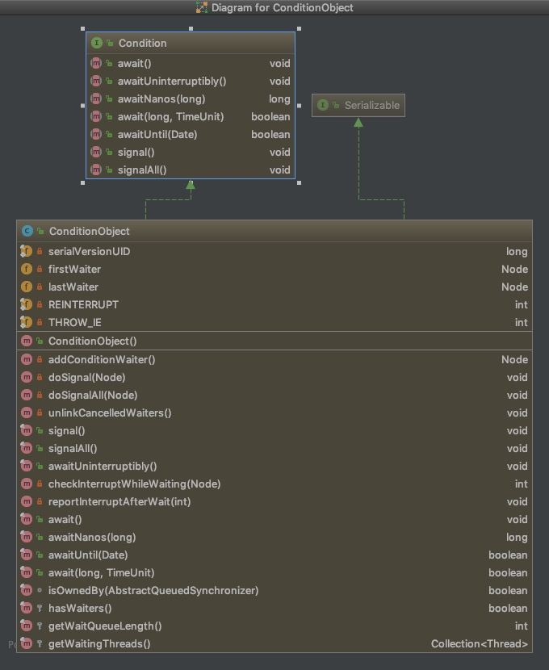

# AQS源码学习 三

### 关键信息
> jdk 1.8<br/>
> java.util.concurrent.locks.AbstractQueuedSynchronizer<br/>
> java.util.concurrent.locks.AbstractQueuedSynchronizer.Node<br/>
> java.util.concurrent.locks.AbstractQueuedSynchronizer.ConditionObject

### 摘要
- [ConditionObject](#ConditionObject)
- [条件等待队列](#条件等待队列)
- [条件等待队列的辅助方法](#辅助方法)
- [条件等待](#await)
- [条件通知](#signal、signalAll)

### ConditionObject
这个类是AQS的内部类，方法和字段都挺多的，直接看类图吧

ConditionObject是用来实现对应object.notify和object.wait方法的功能的<br/>
await方法对应object.wait，signal方法对应object.wait，signalAll对应object.notifyAll<br/>
<br/>
像object调用wait、notify、notifyAll时需要获取object作为monitor对象一样，使用ConditionObject对应方法时需持有其**排它montitor**才行<br/>
具体就是使用AQS提供的 *isHeldExclusively* 方法判断，这个方法是个模板方法，交给子类实现<br/>
所以也可以看到ReentrantReadWriteLock中的**ReadLock不支持newCondition操作**，因为持有ReadLock时持有的是共享锁，而不是排它锁<br/>
<br/>
再回到ConditionObject，使用其方法时**必须持有AQS的排它资源**，所以调用其方法时同一时间只会有一个线程在操作<br/>
于是ConditionObject中字段都不是volatile的，方法中也没有cas操作的使用，因为不需要<br/>

### 条件等待队列
ConditionObject内部的 *firstWaiter* 和 *lastWaiter* 字段就是其内部**条件等待队列**的头和尾<br/>
简要说下其工作流程：
- 调用AQS对象X的ConditionObject对象A的await方法
  - 将线程包装成Node节点加入A中的条件等待队列
  - 完全释放当前线程持有的X的排它资源
  - 唤醒X中等待队列的线程竞争资源
  - 当前线程阻塞在await方法处，待signal、signalAll方法加入等待队列
  - 持有X资源的线程调用release唤醒了阻塞在await处的线程
  - 唤醒后当前线程加入X的等待队列，排队参与竞争
- 调用AQS对象X的ConditionObject对象A的signal、signalAll方法
  - 判断队列不为空
  - signal方法将A中条件等待队列的头结点（队首）加入X中的等待队列
  - signalAll方法将A中条件等待队列的所有节点加入X中的等待队列

上面例子的对象A是ConditionObject对象，而X是AQS对象，X对象可以生成多个条件对象<br/>
也就是一个AQS对象可以有多个ConditionObject对象，实现**多个条件等待队列分别等待**同一个排它资源<br/>
这是object.wait、object.notify、object.notifyAll做不到的<br/>
<br/>
注意AQS对象中的等待队列和其ConditionObject对象的条件等待队列是两个队列<br/>
ConditionObject的条件等待队列firstWaiter是实际节点，**不是哨兵节点**

### 辅助方法
条件等待和唤醒的使用就是通过await、signal、signalAll三个方法完成的，接下来会分析这三个方法的源码<br/>
先看下一些会用到的辅助方法：<br/>
```java
//完整释放排它资源
final int fullyRelease(Node node) {
    boolean failed = true;
    try {
        int savedState = getState();
        if (release(savedState)) {
            failed = false;
            return savedState;
        } else {
            throw new IllegalMonitorStateException();
        }
    } finally {
        if (failed)
            node.waitStatus = Node.CANCELLED;
    }
}
```
上面部分是AQS中的方法<br/>
<br/>
fullyRelease方法不是public方法，全是在await方法中调用的，也就是调用时当前线程一定持有了AQS的排它资源<br/>
- 获取state的全部值，一般来说这个值就是所有排它资源的总量
- 调用release方法全部释放
- 发生异常释放失败时将当前节点置为取消状态

```java
//加入条件等待队列
private Node addConditionWaiter() {
    Node t = lastWaiter;
    // If lastWaiter is cancelled, clean out.
    if (t != null && t.waitStatus != Node.CONDITION) {
        unlinkCancelledWaiters();
        t = lastWaiter;
    }
    Node node = new Node(Thread.currentThread(), Node.CONDITION);
    if (t == null)
        firstWaiter = node;
    else
        t.nextWaiter = node;
    lastWaiter = node;
    return node;
}
//清除条件等待队列取消节点
private void unlinkCancelledWaiters() {
    Node t = firstWaiter;
    Node trail = null;
    while (t != null) {
        Node next = t.nextWaiter;
        if (t.waitStatus != Node.CONDITION) {
            t.nextWaiter = null;
            if (trail == null)
                firstWaiter = next;
            else
                trail.nextWaiter = next;
            if (next == null)
                lastWaiter = trail;
        }
        else
            trail = t;
        t = next;
    }
}
```
上面部分是ConditionObject中的方法<br/>
<br/>
addConditionWaiter负责将当前线程包装成Node放入等待队列
- 判断队列不为空且尾节点状态是取消状态（条件队列中的节点只会有CONDITION和CANCELLED两种状态）则清除队列中的取消状态节点
- 队列为空则当前节点为队首
- 队尾存在时其后继节点为当前节点
- 当前节点为队尾

unlinkCancelledWaiters负责清除条件等待队列中状态为取消的节点<br/>
循环从头至尾遍历整个队列<br/>
t表示当前节点，trail表示队列中前一个不为取消状态的节点，next表示当前节点的后继，每轮循环迭代t=next遍历队列，于是：
- 如果当前节点t状态不为取消，则令trail=t，进入下一轮循环
- 当前节点如果为取消状态
  - 清除当前节点的后继
  - 如果trail为空，表示队列前部不存在不为取消状态的节点，设置队首为next，否则trail的后继设置为next（这一步相当于从队列中清除了当前节点t）
  - 后继如果为空，将队尾设置为trail（这一步维护了尾节点的正确性 ）

其实unlinkCancelledWaiters方法就是比较标准的单向链表删除中间节点的操作（虽然Node可以做双向链表，但是ConditionObject中只是用了next字段维护单向链表）

### await
```java
//ConditionObject的方法
public final void await() throws InterruptedException {
    if (Thread.interrupted())
        throw new InterruptedException();
    Node node = addConditionWaiter();
    int savedState = fullyRelease(node);
    int interruptMode = 0;
    while (!isOnSyncQueue(node)) {
        LockSupport.park(this);
        if ((interruptMode = checkInterruptWhileWaiting(node)) != 0)
            break;
    }
    if (acquireQueued(node, savedState) && interruptMode != THROW_IE)
        interruptMode = REINTERRUPT;
    if (node.nextWaiter != null) // clean up if cancelled
        unlinkCancelledWaiters();
    if (interruptMode != 0)
        reportInterruptAfterWait(interruptMode);
}
//AQS中的方法，判断是否在同步等待队列中
final boolean isOnSyncQueue(Node node) {
    if (node.waitStatus == Node.CONDITION || node.prev == null)
        return false;
    if (node.next != null)
        return true;
    return findNodeFromTail(node);
}
//AQS中的方法，在同步等待队列中查找节点
private boolean findNodeFromTail(Node node) {
    Node t = tail;
    for (;;) {
        if (t == node)
            return true;
        if (t == null)
            return false;
        t = t.prev;
    }
}
```
前面已经说过了addConditionWaiter方法和fullyRelease方法，这里直接说await方法的流程逻辑
- 先进入条件等待队列
- 完整释放当前线程持有的排它资源
- 循环判断当前节点是否在同步等待队列中，如果不在说明还未被信号唤醒，需要阻塞等待
- 出循环一定已经在同步队列中（checkInterruptWhileWaiting方法判断中断会将当前节点放入同步等待队列中）
- 调用[acquireQueued](./javaAqsLearn2.md#排它节点获取)进入在AQS中的同步队列竞争逻辑
- 最后清除队列后继的取消节点
- 判断中断状态返回

### signal、signalAll
```java
//ConditionObject的方法，通知一个线程
public final void signal() {
    if (!isHeldExclusively())
        throw new IllegalMonitorStateException();
    Node first = firstWaiter;
    if (first != null)
        doSignal(first);
}
//ConditionObject的方法
private void doSignal(Node first) {
    do {
        if ( (firstWaiter = first.nextWaiter) == null)
            lastWaiter = null;
        first.nextWaiter = null;
    } while (!transferForSignal(first) &&
                (first = firstWaiter) != null);
}
//ConditionObject的方法，全部通知
public final void signalAll() {
    if (!isHeldExclusively())
        throw new IllegalMonitorStateException();
    Node first = firstWaiter;
    if (first != null)
        doSignalAll(first);
}
//ConditionObject的方法
private void doSignalAll(Node first) {
    lastWaiter = firstWaiter = null;
    do {
        Node next = first.nextWaiter;
        first.nextWaiter = null;
        transferForSignal(first);
        first = next;
    } while (first != null);
}
//AQS中的方法，将节点从条件等待队列转换加入AQS的同步等待队列
final boolean transferForSignal(Node node) {
    if (!compareAndSetWaitStatus(node, Node.CONDITION, 0))
        return false;
    Node p = enq(node);
    int ws = p.waitStatus;
    if (ws > 0 || !compareAndSetWaitStatus(p, ws, Node.SIGNAL))
        LockSupport.unpark(node.thread);
    return true;
}
```
signal和signalAll方法的主要逻辑基本一致，都是判断队列不为空则进行通知，区别是signal只通知条件等待队列头结点，而signalAll通知整个队列<br/>
<br/>
transferForSignal方法会把传入的条件等待队列节点加入同步等待队列，并修改前驱节点状态为SIGNAL<br/>
如果前驱节点为**取消状态或者修改状态失败**，此时需要唤醒该节点线程维护该节点的状态<br/>
从上文中已经知道，被唤醒的节点一定会进入AQS同步队列，竞争排它资源<br/>
失败则会在acquireQueued方法中调用shouldParkAfterFailedAcquire方法维护状态正确然后再阻塞<br/>
**所以此处的唤醒主要目的是维护状态和同步等待队列正确**<br/>
完成transferForSignal操作后，节点会被移出条件等待队列，这样就完成了节点从条件等待队列出队，入队同步等待队列的操作

### 总结
本篇介绍了AQS中的ConditionObject，从源码分析了条件等待队列的结构和行为<br/>
至此AQS的主要功能全部都记录完了

> AQS和ConditionObject的各种定时方法都未介绍，但骨干逻辑都是一样的<br/>
> 中断判断和中断异常的抛出没有总结，基本都是中断唤醒后判断状态决定是否要抛出异常，这里就不详细说了